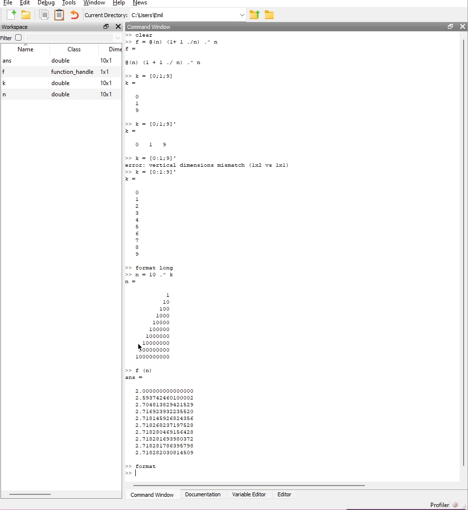
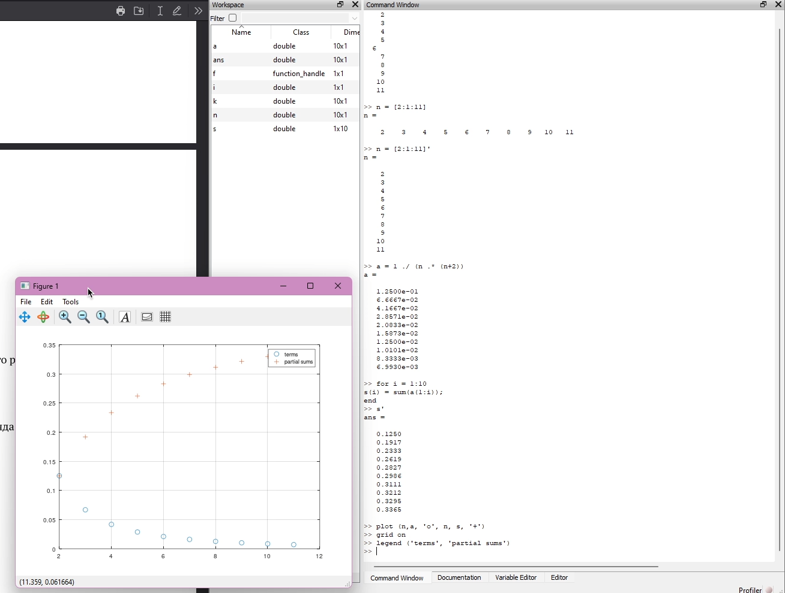
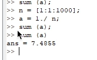
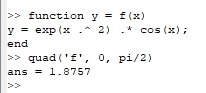
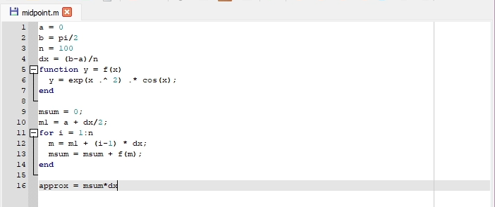
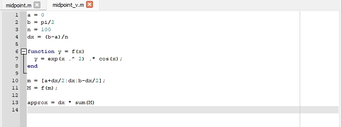
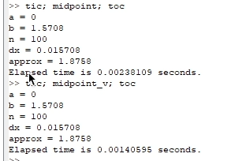

---
## Front matter
title: "Отчёт по лабораторной работе №6"
subtitle: "НКНбд-01-21"
author: "Самигуллин Эмиль Артурович"

## Generic otions
lang: ru-RU
toc-title: "Содержание"

## Bibliography
bibliography: bib/cite.bib
csl: pandoc/csl/gost-r-7-0-5-2008-numeric.csl

## Pdf output format
toc: true # Table of contents
toc-depth: 2
fontsize: 12pt
linestretch: 1.5
papersize: a4
documentclass: scrreprt
## I18n polyglossia
polyglossia-lang:
  name: russian
  options:
	- spelling=modern
	- babelshorthands=true
polyglossia-otherlangs:
  name: english
## I18n babel
babel-lang: russian
babel-otherlangs: english
## Fonts
mainfont: PT Serif
romanfont: PT Serif
sansfont: PT Sans
monofont: PT Mono
mainfontoptions: Ligatures=TeX
romanfontoptions: Ligatures=TeX
sansfontoptions: Ligatures=TeX,Scale=MatchLowercase
monofontoptions: Scale=MatchLowercase,Scale=0.9
## Biblatex
biblatex: true
biblio-style: "gost-numeric"
biblatexoptions:
  - parentracker=true
  - backend=biber
  - hyperref=auto
  - language=auto
  - autolang=other*
  - citestyle=gost-numeric
## Pandoc-crossref LaTeX customization
figureTitle: "Рис."
tableTitle: "Таблица"
listingTitle: "Листинг"
lofTitle: "Цель Работы"
lotTitle: "Ход Работы"
lolTitle: "Листинги"
## Misc options
indent: true
header-includes:
  - \usepackage{indentfirst}
  - \usepackage{float} # keep figures where there are in the text
  - \floatplacement{figure}{H} # keep figures where there are in the text
---

# Цель работы

Освоение работы с последовательностями, пределами и рядами в Octave.

# Ход работы

1. Вычисление предела $lim_{n \rightarrow \infty} (1 + \frac{1}{n})^n$. (рис. [-@fig:001])

   { #fig:001 width=70% }

2. Вычисление частичных сумм ряда $a_n = \frac{1}{n(n+2)}$. (рис. [-@fig:002])

   { #fig:002 width=70% }

3. Вычисление суммы ряда $\sum_{n=1}^{1000} \frac{1}{n}$. (рис. [-@fig:003])

   { #fig:003 width=70% }

4. Вычисление интеграла $\int_{0}^{\frac{\pi}{2}} e^{x^2} \cos(x)dx$. (рис. [-@fig:004])

   { #fig:004 width=70% }

5. Аппроксимация суммы ряда с использованием цикла. (рис. [-@fig:005])

   { #fig:005 width=70% }

6. Аппроксимация суммы ряда с использованием вектора. (рис. [-@fig:006])

   { #fig:006 width=70% }

7. Сравнение результатов вычислений. (рис. [-@fig:007])

   { #fig:007 width=70% }

# Вывод

В ходе выполнения лабораторной работы были изучены основные принципы работы с последовательностями, рядами и пределами в среде Octave. 

::: {#refs}
:::
