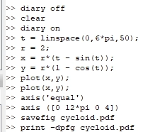
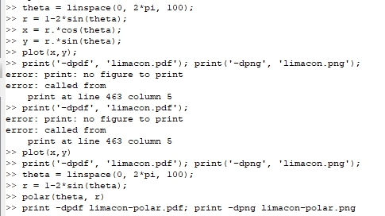
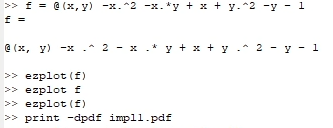
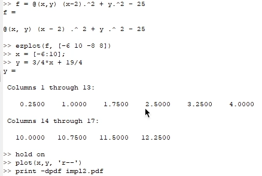
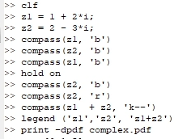
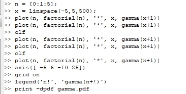
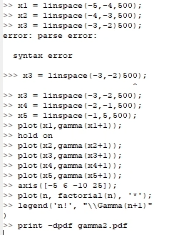

---
## Front matter
title: "Отчёт по лабораторной работе №7"
subtitle: "НКНбд-01-21"
author: "Самигуллин Эмиль Артурович"

## Generic otions
lang: ru-RU
toc-title: "Содержание"

## Bibliography
bibliography: bib/cite.bib
csl: pandoc/csl/gost-r-7-0-5-2008-numeric.csl

## Pdf output format
toc: true # Table of contents
toc-depth: 2
fontsize: 12pt
linestretch: 1.5
papersize: a4
documentclass: scrreprt
## I18n polyglossia
polyglossia-lang:
  name: russian
  options:
	- spelling=modern
	- babelshorthands=true
polyglossia-otherlangs:
  name: english
## I18n babel
babel-lang: russian
babel-otherlangs: english
## Fonts
mainfont: PT Serif
romanfont: PT Serif
sansfont: PT Sans
monofont: PT Mono
mainfontoptions: Ligatures=TeX
romanfontoptions: Ligatures=TeX
sansfontoptions: Ligatures=TeX,Scale=MatchLowercase
monofontoptions: Scale=MatchLowercase,Scale=0.9
## Biblatex
biblatex: true
biblio-style: "gost-numeric"
biblatexoptions:
  - parentracker=true
  - backend=biber
  - hyperref=auto
  - language=auto
  - autolang=other*
  - citestyle=gost-numeric
## Pandoc-crossref LaTeX customization
figureTitle: "Рис."
tableTitle: "Таблица"
listingTitle: "Листинг"
lofTitle: "Цель Работы"
lotTitle: "Ход Работы"
lolTitle: "Листинги"
## Misc options
indent: true
header-includes:
  - \usepackage{indentfirst}
  - \usepackage{float} # keep figures where there are in the text
  - \floatplacement{figure}{H} # keep figures where there are in the text
---

# Цель работы

- Изучение базовых возможностей Octave для построения графиков математических функций и параметрических кривых в декартовых и полярных координатах, а также в комплексной плоскости. 

- Освоение методов построения графиков неявных функций и специальных функций, таких как гамма-функция и факториал.

# Ход работы

1. Построили параметрические графики $\begin{aligned} x &= r(t-\sin{t}) \\ y &= r(1-\cos{t}) \end{aligned}$. (рис. [-@fig:001])

  { #fig:001 width=70% }
  
2. Используя полярные координаты $x = r \cos(\theta), y = r \sin(\theta)$, где $r = f(\theta)$, построили графики. (рис. [-@fig:002])

   { #fig:002 width=70% }

3. Построили графики неявной функции $f(x,y) = 0$. (рис. [-@fig:003], [-@fig:004])

   { #fig:003 width=70% }

   { #fig:004 width=70% }

4. Построили графики для переменных $z_1=1+2i$ и $z_2=2-i3$ в комплексной плоскости. (рис. [-@fig:005])

   { #fig:005 width=70% }

5. Построили графики для функций $\Gamma(x+1)$ и $n!$. (рис. [-@fig:006], [-@fig:007])

   { #fig:006 width=70% }

   { #fig:007 width=70% }

# Выводы
   
- В результате работы были изучены базовые возможности Octave для построения графиков математических функций и параметрических кривых в декартовых и полярных координатах, а также в комплексной плоскости. 

- Были освоены методы построения графиков неявных функций и специальных функций, таких как гамма-функция и факториал. 

- В ходе практики были построены различные графики, и это помогло лучше понять различные математические функции и их свойства.

::: {#refs}
:::
