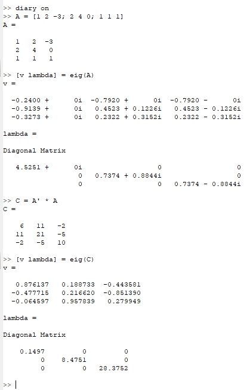
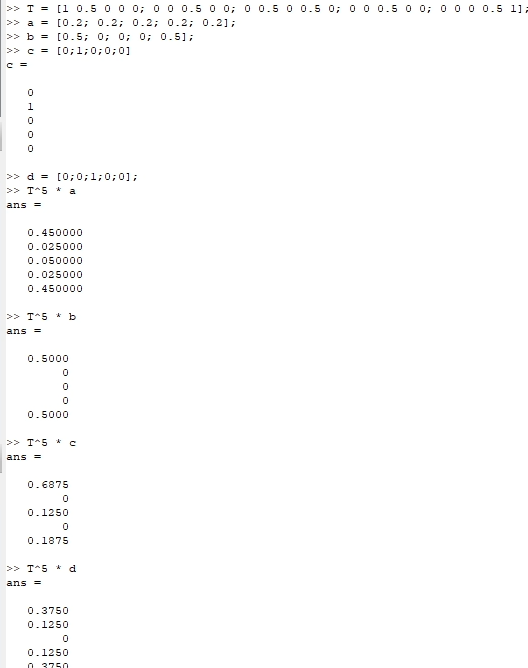
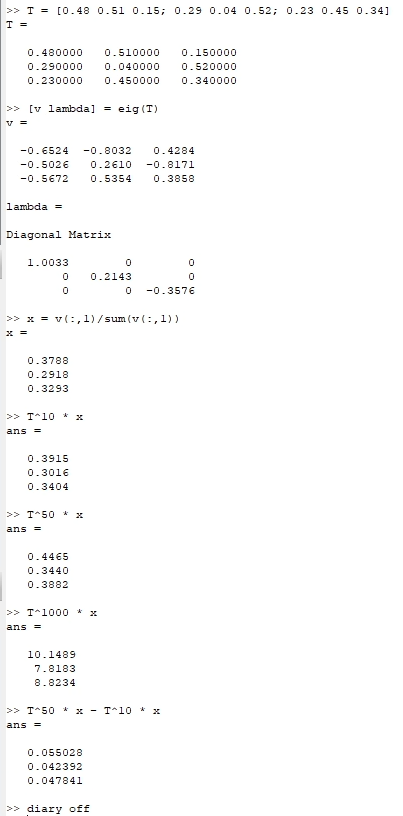

---
## Front matter
title: "Отчёт по лабораторной работе №8"
subtitle: "НКНбд-01-21"
author: "Самигуллин Эмиль Артурович"

## Generic otions
lang: ru-RU
toc-title: "Содержание"

## Bibliography
bibliography: bib/cite.bib
csl: pandoc/csl/gost-r-7-0-5-2008-numeric.csl

## Pdf output format
toc: true # Table of contents
toc-depth: 2
fontsize: 12pt
linestretch: 1.5
papersize: a4
documentclass: scrreprt
## I18n polyglossia
polyglossia-lang:
  name: russian
  options:
	- spelling=modern
	- babelshorthands=true
polyglossia-otherlangs:
  name: english
## I18n babel
babel-lang: russian
babel-otherlangs: english
## Fonts
mainfont: PT Serif
romanfont: PT Serif
sansfont: PT Sans
monofont: PT Mono
mainfontoptions: Ligatures=TeX
romanfontoptions: Ligatures=TeX
sansfontoptions: Ligatures=TeX,Scale=MatchLowercase
monofontoptions: Scale=MatchLowercase,Scale=0.9
## Biblatex
biblatex: true
biblio-style: "gost-numeric"
biblatexoptions:
  - parentracker=true
  - backend=biber
  - hyperref=auto
  - language=auto
  - autolang=other*
  - citestyle=gost-numeric
## Pandoc-crossref LaTeX customization
figureTitle: "Рис."
tableTitle: "Таблица"
listingTitle: "Листинг"
lofTitle: "Цель Работы"
lotTitle: "Ход Работы"
lolTitle: "Листинги"
## Misc options
indent: true
header-includes:
  - \usepackage{indentfirst}
  - \usepackage{float} # keep figures where there are in the text
  - \floatplacement{figure}{H} # keep figures where there are in the text
---

# Цель работы

- Изучение задачи на собственные значения. 

- Изучение свойств собственных значений и собственных векторов матриц.

- Применение собственных значений и собственных векторов к изучению марковских цепей и случайных блужданий.

# Ход работы

1. Запуск функции eig для получения собственных значений и собственного вектора. (рис. [-@fig:001])

  { #fig:001 width=70% }
  
2. Решение задачи случайного блуждания для 5 шагов. (рис. [-@fig:002])

   { #fig:002 width=70% }

3. Нахождение вектора равновесного стостояния для цепи Маркова. (рис. [-@fig:003])

   { #fig:003 width=70% }

# Вывод

В ходе работы были изучены понятия собственных значений и собственных векторов матриц, а также их свойства. Было показано, как использовать эти понятия для решения задач марковских цепей и случайных блужданий. Была использована функция eig для нахождения собственных значений и собственных векторов. Также был найден вектор равновесного состояния для цепи Маркова. В результате работы были получены базовые знания в области собственных значений и собственных векторов, а также их применение в прикладных задачах.

::: {#refs}
:::