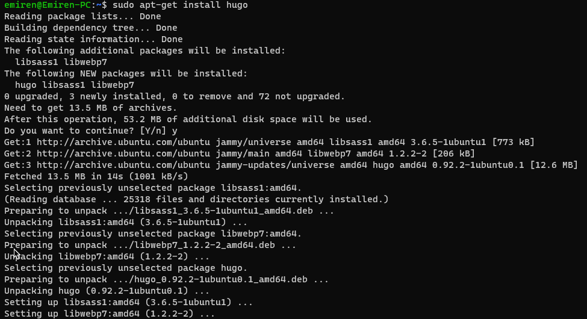
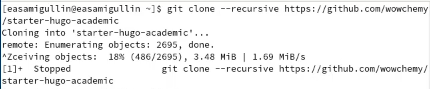
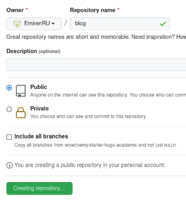
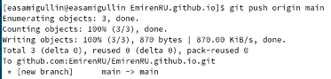
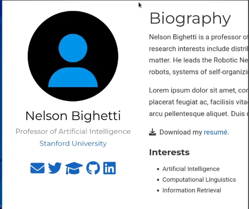

---
## Front matter
title: "Отчёт по индивидуальному проекту. Этап №1."
subtitle: "НКНбд-00-21"
author: "Самигуллин Эмиль Артурович"

## Generic otions
lang: ru-RU
toc-title: "Содержание"

## Bibliography
bibliography: bib/cite.bib
csl: pandoc/csl/gost-r-7-0-5-2008-numeric.csl

## Pdf output format
toc: true # Table of contents
toc-depth: 2
fontsize: 12pt
linestretch: 1.5
papersize: a4
documentclass: scrreprt
## I18n polyglossia
polyglossia-lang:
  name: russian
  options:
	- spelling=modern
	- babelshorthands=true
polyglossia-otherlangs:
  name: english
## I18n babel
babel-lang: russian
babel-otherlangs: english
## Fonts
mainfont: PT Serif
romanfont: PT Serif
sansfont: PT Sans
monofont: PT Mono
mainfontoptions: Ligatures=TeX
romanfontoptions: Ligatures=TeX
sansfontoptions: Ligatures=TeX,Scale=MatchLowercase
monofontoptions: Scale=MatchLowercase,Scale=0.9
## Biblatex
biblatex: true
biblio-style: "gost-numeric"
biblatexoptions:
  - parentracker=true
  - backend=biber
  - hyperref=auto
  - language=auto
  - autolang=other*
  - citestyle=gost-numeric
## Pandoc-crossref LaTeX customization
figureTitle: "Рис."
tableTitle: "Таблица"
listingTitle: "Листинг"
lofTitle: "Цель Работы"
lotTitle: "Ход Работы"
lolTitle: "Листинги"
## Misc options
indent: true
header-includes:
  - \usepackage{indentfirst}
  - \usepackage{float} # keep figures where there are in the text
  - \floatplacement{figure}{H} # keep figures where there are in the text
---

# Цель работы.

Создание и размещение сайта с помощью генератора статических сайтов hugo

# Ход работы.

1. Скачали программное обеспечение Hugo.(рис. [-@fig:001])

{ #fig:001 width=70%}

2. Клонировали репозиторий с шаблоном темы в домашний каталог.(рис. [-@fig:002])
   
{ #fig:002 width=70%}

3. Создание репозитория.(рис. [-@fig:004])

{ #fig:004 width=70%}

4. Отправка сайта на хостинг Github Pages.(рис. [-@fig:005])

{ #fig:005 width=70% }

5. Сайт работает.(рис. [-@fig:006])

{ #fig:006 width=70% }

# Вывод.

Во время выполнения индивидуального проекта, мы научились создавать сайты с помощью генератора статических сайтов Hugo.